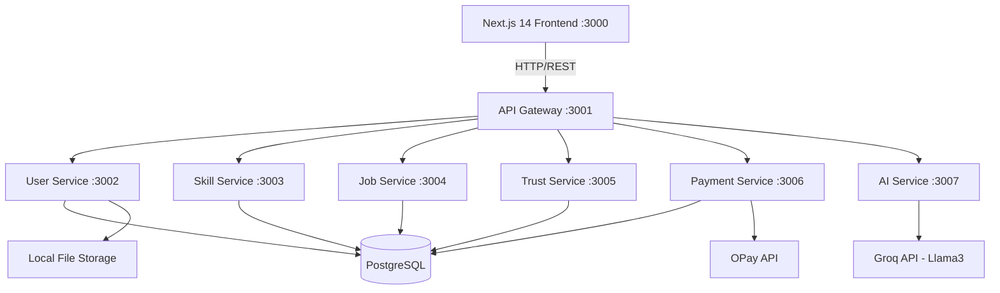

# Design Document: Community Lens Workforce Network

## Overview

Community Lens Workforce Network is a full-stack microservices web application that replaces traditional CV-based hiring with AI-driven skill verification, trust scoring, and escrow-protected payments. Workers build a verified professional identity through real task completion. Clients hire based on proven ability and reputation data.

The system is built as a Next.js 14 frontend communicating with a Node.js microservices backend through an API Gateway, backed by PostgreSQL, with Groq (Llama3) for AI and OPay for payments.

---

## Architecture



All external requests flow through the API Gateway, which handles JWT verification, rate limiting, and CORS before proxying to the appropriate microservice. Services communicate with a shared PostgreSQL instance. The AI Service is the only service that calls external APIs directly (Groq). The Payment Service is the only service that calls OPay.

---

## Components and Interfaces

### API Gateway (port 3001)
- Validates JWT on all protected routes
- Applies rate limiting (auth routes: 10 req/min; general: 100 req/min)
- CORS configuration for frontend origin
- Proxies to services by path prefix: `/auth/*`, `/users/*` → User Service; `/skills/*`, `/assessments/*` → Skill Service; `/jobs/*`, `/contracts/*`, `/milestones/*`, `/applications/*` → Job Service; `/trust/*`, `/reviews/*` → Trust Service; `/payments/*` → Payment Service; `/ai/*` → AI Service

### User Service (port 3002)
| Method | Route | Description |
|--------|-------|-------------|
| POST | /auth/register | Register worker or company |
| POST | /auth/login | Login, returns JWT |
| POST | /auth/logout | Invalidate token |
| GET | /users/:id | Get user profile |
| PUT | /users/:id | Update profile |
| POST | /users/:id/avatar | Upload avatar |
| GET | /users/:id/portfolio | Get portfolio items |
| POST | /users/:id/portfolio | Add portfolio item |

### Skill Service (port 3003)
| Method | Route | Description |
|--------|-------|-------------|
| GET | /skills | List all skill categories |
| GET | /skills/:id | Get skill detail |
| POST | /assessments | Submit assessment |
| GET | /assessments/:userId | Get user's assessments |
| GET | /skill-scores/:userId | Get user's skill levels |
| PUT | /skill-scores/:userId/:skillId | Update after assessment |

### Job Service (port 3004)
| Method | Route | Description |
|--------|-------|-------------|
| POST | /jobs | Post a job |
| GET | /jobs | List open jobs |
| GET | /jobs/:id | Job detail |
| PUT | /jobs/:id | Update job |
| DELETE | /jobs/:id | Cancel job |
| POST | /jobs/:id/apply | Worker applies |
| GET | /jobs/:id/applications | View applications |
| PUT | /applications/:id | Accept/reject application |
| POST | /contracts | Create contract |
| GET | /contracts/:id | Contract detail |
| POST | /contracts/:id/milestones | Add milestone |
| PUT | /milestones/:id | Update milestone status |
| POST | /disputes | Raise a dispute |
| GET | /disputes/:id | Get dispute detail |
| PUT | /disputes/:id/resolve | Moderator resolves dispute |

### Trust Service (port 3005)
| Method | Route | Description |
|--------|-------|-------------|
| GET | /trust/:userId | Get trust score |
| POST | /reviews | Submit review |
| GET | /reviews/:userId | Get reviews |
| PUT | /trust/:userId/recalculate | Recalculate trust score |

Trust Score Formula:
- Completion rate: 40%
- On-time rate: 25%
- Average rating (1–5 normalized to 0–100): 25%
- No disputes bonus: 10%

`trust_score = (completion_rate × 0.40) + (on_time_rate × 0.25) + ((avg_rating / 5 × 100) × 0.25) + (disputes_count === 0 ? 10 : 0)`

### Payment Service (port 3006)
| Method | Route | Description |
|--------|-------|-------------|
| POST | /payments/initiate | Create escrow payment via OPay |
| POST | /payments/verify | Verify OPay webhook/callback |
| POST | /payments/release | Release payment to worker |
| POST | /payments/refund | Refund to company |
| GET | /payments/history/:userId | Payment history |

### AI Service (port 3007)
| Method | Route | Description |
|--------|-------|-------------|
| POST | /ai/onboard | Analyze user background, return profile |
| POST | /ai/assess | Evaluate skill assessment, return score + feedback |
| POST | /ai/match | Compute worker-job match score |
| POST | /ai/chat | Career guidance chat |
| POST | /ai/resources | Recommend community resources |

All Groq calls use model `llama3-8b-8192` via OpenAI-compatible format at `https://api.groq.com/openai/v1`.

---

## Data Models

### users
```sql
id UUID PRIMARY KEY DEFAULT gen_random_uuid()
email VARCHAR(255) UNIQUE NOT NULL
password_hash VARCHAR(255) NOT NULL
full_name VARCHAR(255) NOT NULL
phone VARCHAR(20)
role VARCHAR(20) NOT NULL CHECK (role IN ('worker', 'company', 'admin'))
avatar_url TEXT
location VARCHAR(255)
bio TEXT
is_verified BOOLEAN DEFAULT false
created_at TIMESTAMPTZ DEFAULT NOW()
updated_at TIMESTAMPTZ DEFAULT NOW()
```

### companies
```sql
id UUID PRIMARY KEY DEFAULT gen_random_uuid()
user_id UUID REFERENCES users(id) ON DELETE CASCADE
company_name VARCHAR(255) NOT NULL
industry VARCHAR(100)
description TEXT
website VARCHAR(255)
logo_url TEXT
is_verified BOOLEAN DEFAULT false
created_at TIMESTAMPTZ DEFAULT NOW()
```

### skills
```sql
id UUID PRIMARY KEY DEFAULT gen_random_uuid()
name VARCHAR(100) NOT NULL
category VARCHAR(100) NOT NULL
description TEXT
created_at TIMESTAMPTZ DEFAULT NOW()
```

### assessments
```sql
id UUID PRIMARY KEY DEFAULT gen_random_uuid()
user_id UUID REFERENCES users(id)
skill_id UUID REFERENCES skills(id)
task_description TEXT NOT NULL
submission_url TEXT
ai_feedback TEXT
score INTEGER CHECK (score >= 0 AND score <= 100)
status VARCHAR(20) DEFAULT 'pending' CHECK (status IN ('pending','submitted','evaluated'))
created_at TIMESTAMPTZ DEFAULT NOW()
```

### skill_scores
```sql
id UUID PRIMARY KEY DEFAULT gen_random_uuid()
user_id UUID REFERENCES users(id)
skill_id UUID REFERENCES skills(id)
score INTEGER DEFAULT 0 CHECK (score >= 0 AND score <= 100)
level INTEGER DEFAULT 0 CHECK (level >= 0 AND level <= 4)
verified_at TIMESTAMPTZ
updated_at TIMESTAMPTZ DEFAULT NOW()
UNIQUE(user_id, skill_id)
```

### jobs
```sql
id UUID PRIMARY KEY DEFAULT gen_random_uuid()
company_id UUID REFERENCES companies(id)
title VARCHAR(255) NOT NULL
description TEXT NOT NULL
required_skills JSONB
budget NUMERIC(12,2) NOT NULL
currency VARCHAR(10) DEFAULT 'NGN'
duration VARCHAR(100)
status VARCHAR(20) DEFAULT 'open' CHECK (status IN ('open','in_progress','completed','cancelled'))
created_at TIMESTAMPTZ DEFAULT NOW()
```

### applications
```sql
id UUID PRIMARY KEY DEFAULT gen_random_uuid()
job_id UUID REFERENCES jobs(id)
worker_id UUID REFERENCES users(id)
cover_note TEXT
status VARCHAR(20) DEFAULT 'pending' CHECK (status IN ('pending','accepted','rejected'))
ai_match_score INTEGER CHECK (ai_match_score >= 0 AND ai_match_score <= 100)
created_at TIMESTAMPTZ DEFAULT NOW()
```

### contracts
```sql
id UUID PRIMARY KEY DEFAULT gen_random_uuid()
job_id UUID REFERENCES jobs(id)
worker_id UUID REFERENCES users(id)
company_id UUID REFERENCES companies(id)
terms TEXT
status VARCHAR(20) DEFAULT 'active' CHECK (status IN ('active','completed','disputed'))
started_at TIMESTAMPTZ DEFAULT NOW()
completed_at TIMESTAMPTZ
```

### milestones
```sql
id UUID PRIMARY KEY DEFAULT gen_random_uuid()
contract_id UUID REFERENCES contracts(id)
title VARCHAR(255) NOT NULL
description TEXT
amount NUMERIC(12,2) NOT NULL
status VARCHAR(20) DEFAULT 'pending' CHECK (status IN ('pending','submitted','approved','rejected'))
due_date TIMESTAMPTZ
completed_at TIMESTAMPTZ
```

### payments
```sql
id UUID PRIMARY KEY DEFAULT gen_random_uuid()
contract_id UUID REFERENCES contracts(id)
milestone_id UUID REFERENCES milestones(id)
amount NUMERIC(12,2) NOT NULL
currency VARCHAR(10) DEFAULT 'NGN'
status VARCHAR(20) DEFAULT 'held' CHECK (status IN ('held','released','refunded'))
opay_reference VARCHAR(255)
created_at TIMESTAMPTZ DEFAULT NOW()
```

### trust_scores
```sql
id UUID PRIMARY KEY DEFAULT gen_random_uuid()
user_id UUID REFERENCES users(id) UNIQUE
score NUMERIC(5,2) DEFAULT 0
completion_rate NUMERIC(5,2) DEFAULT 0
on_time_rate NUMERIC(5,2) DEFAULT 0
rating_average NUMERIC(3,2) DEFAULT 0
jobs_completed INTEGER DEFAULT 0
disputes_count INTEGER DEFAULT 0
updated_at TIMESTAMPTZ DEFAULT NOW()
```

### reviews
```sql
id UUID PRIMARY KEY DEFAULT gen_random_uuid()
contract_id UUID REFERENCES contracts(id)
reviewer_id UUID REFERENCES users(id)
reviewee_id UUID REFERENCES users(id)
rating INTEGER CHECK (rating >= 1 AND rating <= 5)
comment TEXT
created_at TIMESTAMPTZ DEFAULT NOW()
```

### portfolio
```sql
id UUID PRIMARY KEY DEFAULT gen_random_uuid()
user_id UUID REFERENCES users(id)
title VARCHAR(255) NOT NULL
description TEXT
project_url TEXT
image_url TEXT
skills_used JSONB
verified BOOLEAN DEFAULT false
created_at TIMESTAMPTZ DEFAULT NOW()
```

### resources
```sql
id UUID PRIMARY KEY DEFAULT gen_random_uuid()
title VARCHAR(255) NOT NULL
description TEXT
category VARCHAR(50) CHECK (category IN ('training','food','health','opportunity'))
url TEXT
location VARCHAR(255)
created_at TIMESTAMPTZ DEFAULT NOW()
```

### subscriptions
```sql
id UUID PRIMARY KEY DEFAULT gen_random_uuid()
user_id UUID REFERENCES users(id)
plan VARCHAR(20) DEFAULT 'free' CHECK (plan IN ('free','pro'))
status VARCHAR(20) DEFAULT 'active' CHECK (status IN ('active','cancelled'))
started_at TIMESTAMPTZ DEFAULT NOW()
expires_at TIMESTAMPTZ
```

### disputes
```sql
id UUID PRIMARY KEY DEFAULT gen_random_uuid()
contract_id UUID REFERENCES contracts(id)
milestone_id UUID REFERENCES milestones(id)
raised_by UUID REFERENCES users(id)
reason TEXT NOT NULL
evidence_url TEXT
status VARCHAR(20) DEFAULT 'open' CHECK (status IN ('open','under_review','resolved'))
resolution TEXT
resolved_by UUID REFERENCES users(id)
resolved_at TIMESTAMPTZ
created_at TIMESTAMPTZ DEFAULT NOW()
```

---

## Correctness Properties

*A property is a characteristic or behavior that should hold true across all valid executions of a system — essentially, a formal statement about what the system should do. Properties serve as the bridge between human-readable specifications and machine-verifiable correctness guarantees.*

---

### Property 1: Skill Level is a deterministic function of Skill Score

*For any* integer score in [0, 100], the skill level assignment function SHALL always return the same level: 0–20 → Level 0, 21–40 → Level 1, 41–60 → Level 2, 61–80 → Level 3, 81–100 → Level 4. No score maps to two different levels and no valid score maps to an undefined level.

**Validates: Requirements 2.3**

---

### Property 2: Trust Score is bounded and formula-consistent

*For any* combination of completion_rate, on_time_rate, avg_rating, and disputes_count within valid ranges, the computed Trust Score SHALL be a value in [0, 100] and SHALL equal `(completion_rate × 0.40) + (on_time_rate × 0.25) + ((avg_rating / 5 × 100) × 0.25) + (disputes_count === 0 ? 10 : 0)`.

**Validates: Requirements 5.1, 5.2**

---

### Property 3: Escrow lock precedes work

*For any* contract creation event, a payment record with status `held` SHALL exist for the full contract value before the contract status transitions to `active`. No contract with status `active` shall exist without a corresponding `held` payment record.

**Validates: Requirements 4.1, 3.4**

---

### Property 4: Skill Score is immutable by the Worker

*For any* Worker user, PUT or PATCH requests targeting skill_scores that originate from the Worker's own JWT SHALL be rejected with an authorization error. Only the Skill Service (acting on AI assessment results) may write to skill_scores.

**Validates: Requirements 2.6**

---

### Property 5: Match Score inputs are monotonically contributing

*For any* two Worker profiles A and B where A has a strictly higher Skill Score for the required skill and an equal or higher Trust Score compared to B, the AI Service SHALL assign A a Match Score greater than or equal to B's Match Score for the same job.

**Validates: Requirements 3.3**

---

### Property 6: Payment release reduces escrow balance

*For any* milestone approval event, the payment record for that milestone SHALL transition from `held` to `released`, and the sum of all `held` payment amounts for a contract SHALL decrease by exactly the milestone amount.

**Validates: Requirements 4.3, 4.5**

---

### Property 7: Trust Score recalculation is idempotent

*For any* user's trust score, calling recalculate twice in succession without any new reviews or contracts SHALL produce the same Trust Score both times.

**Validates: Requirements 5.6**

---

### Property 8: AI onboarding profile round-trip consistency

*For any* structured profile object produced by the AI onboarding endpoint, serializing it to JSON and deserializing it SHALL produce an object equal to the original with no fields lost or mutated.

**Validates: Requirements 1.1**

---

### Property 9: Dispute count accumulation monotonicity

*For any* user, the disputes_count field in trust_scores SHALL never decrease as a result of a dispute being raised. It SHALL only increase or remain the same.

**Validates: Requirements 9.5, 5.3**

---

### Property 10: Pro Membership does not alter Skill Score

*For any* Worker, activating or maintaining a Pro Membership subscription SHALL produce no change in any row in skill_scores for that Worker.

**Validates: Requirements 8.3**

---

## Error Handling

- All services return a consistent error envelope: `{ success: false, error: { code: string, message: string } }`
- The API Gateway returns 401 for missing/invalid JWT, 429 for rate limit exceeded, 502 for unreachable upstream service
- The Payment Service handles OPay webhook failures by retrying up to 3 times with exponential backoff before logging a permanent failure
- The AI Service validates and sanitizes all user-supplied text before sending to Groq; prompts exceeding token limits are truncated with a warning logged
- Database constraint violations (e.g., duplicate skill_scores entry) return 409 Conflict
- Milestone auto-approval (when Client does not respond within review period) is handled by a scheduled job that checks pending milestones and transitions them
- All unhandled exceptions are caught by a global error handler, logged with a correlation ID, and return a 500 with the correlation ID for tracing

---

## Testing Strategy

### Property-Based Testing Library

**Backend (Node.js):** `fast-check` — a mature, well-maintained property-based testing library for JavaScript/TypeScript.

Each property-based test runs a minimum of **100 iterations**.

Each property-based test is tagged with:
```
// **Feature: community-lens-workforce, Property {N}: {property_text}**
```

### Unit Testing

**Framework:** Jest (backend), Vitest (frontend)

Unit tests cover:
- Skill level mapping function (all boundary values)
- Trust score formula with known inputs
- JWT generation and verification utilities
- Payment status transition validation
- Input sanitization for AI prompts

### Property-Based Test Plan

| Property | Test Description |
|----------|-----------------|
| P1 | Generate random integers 0–100, assert scoreToLevel is deterministic and covers all 5 levels correctly |
| P2 | Generate random valid rate/rating combinations, assert computed trust score is in [0,100] and matches formula |
| P3 | For any contract creation sequence, assert no active contract exists without a held payment record |
| P4 | Generate Worker JWT requests targeting skill_scores, assert all return 403 |
| P5 | Generate pairs of worker profiles with ordering constraints, assert match score ordering holds |
| P6 | For any milestone approval, assert payment transitions held→released and held sum decreases by milestone amount |
| P7 | Call recalculate twice with no intervening data changes, assert scores are equal |
| P8 | Generate profile objects, serialize to JSON and back, assert deep equality |
| P9 | Simulate dispute raises in sequence, assert disputes_count is non-decreasing |
| P10 | Activate Pro Membership for any Worker, query skill_scores before and after, assert no change |

### Integration Testing

- Full auth flow: register → login → access protected route
- Full job flow: post job → apply → accept → create contract → submit milestone → approve → payment release
- Trust score update after contract completion
